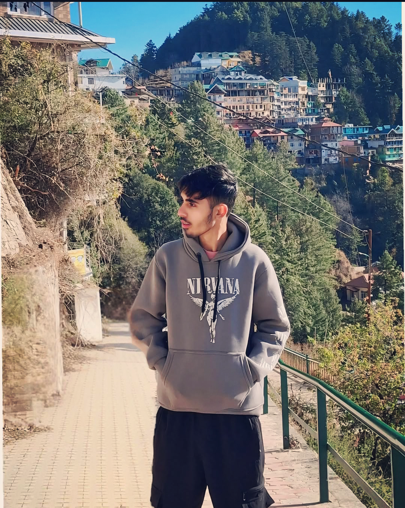
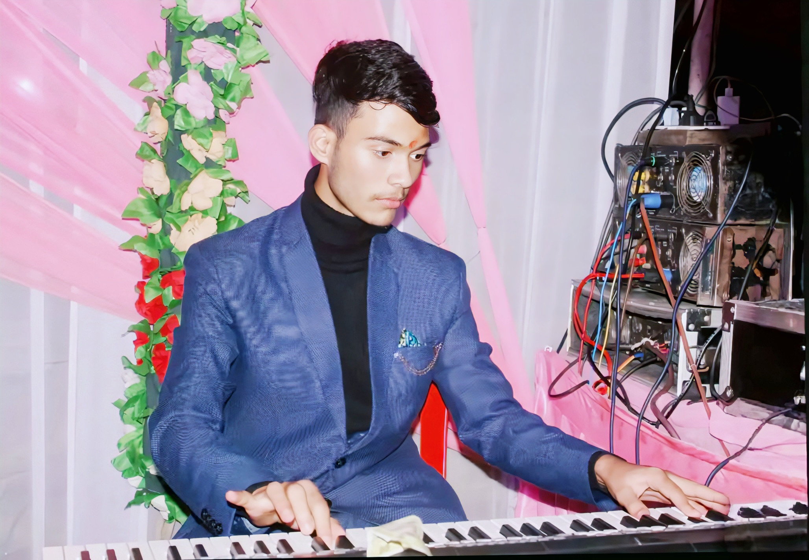

# 1st-website
1st website<!DOCTYPE html>
<html lang="en">
<head>
  <meta charset="UTF-8">
  <meta name="viewport" content="width=device-width, initial-scale=1.0">
  <title>Message Link</title>
  
</head>
<body>

<h1>BACHALER PARTY</h1>
<h2>Welcome to the celebration night!</h2>
<h3 style="color:pink; font-weight:normal; margin-top:-10px;">
  This online party organisation by Sujal kashyap, Rahul, Suryansh Negi
</h3>
  

    
    
    
  

  <h2>Click the button to see the message</h2>
  <button onclick="showMessage()">Click Me</button>

  <!-- Fullscreen Modal -->
  

    &times;
    
  

  
</body>
</html>

